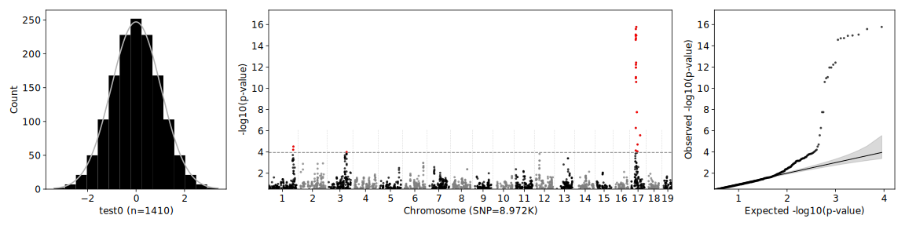
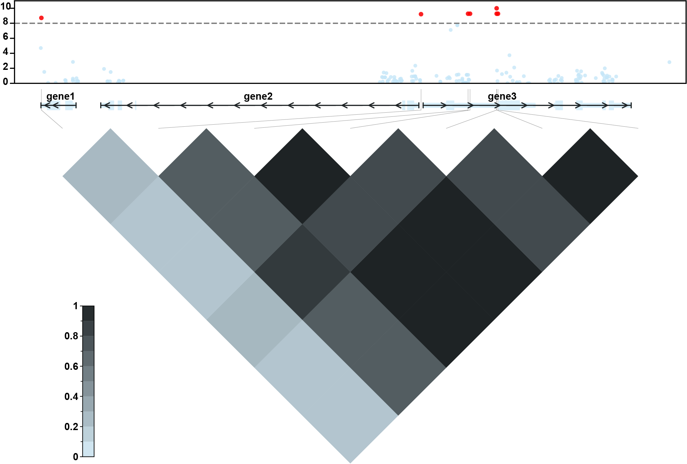
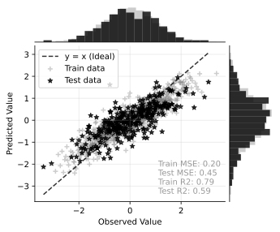

# JanusX

[CLI Doc](./doc/JanusXcli.md) | [Core API Doc](./doc/JanusXcore.md) | [Zea Eureka](https://mp.weixin.qq.com/s/jl3h2DPRC21l8QJ0WxzXDA)


Joint Association and Novel Utility for Selection (JanusX) is a high-performance toolkit for quantitative genetics. It combines Rust-accelerated kernels (PyO3) with Python CLI workflows for GWAS, genomic selection (GS), post-analysis visualization, and variant-processing pipelines.

## Overview

```text
       _                      __   __
      | |                     \ \ / /
      | | __ _ _ __  _   _ ___ \ V / 
  _   | |/ _` | '_ \| | | / __| > <  
 | |__| | (_| | | | | |_| \__ \/ . \ 
  \____/ \__,_|_| |_|\__,_|___/_/ \_\ Tools for GWAS and GS
  ---------------------------------------------------------
```

- Unified CLI entry: `jx`
- Core GWAS models: `LM`, `LMM`, `FarmCPU`
- Core GS models: `GBLUP`, `rrBLUP`, `BayesA`, `BayesB`, `BayesCpi`
- Streaming genotype reader for VCF/PLINK/TXT with low-memory workflows
- Integrated post-analysis tools: `postgwas`, `postbsa`, `postgarfield`
- Additional utilities: `grm`, `pca`, `gmerge`, `fastq2vcf`, `fastq2count`, `sim`, `simulation`

****

## Installation

Requirements:

- Supported OS: Linux / macOS / Windows
- Internet access for first-time runtime setup and updates
- Python/Rust are **not** required for normal end-user installation via launcher installer

### Release Launcher Install (required)

Download the installer asset from GitHub Releases:
<https://github.com/FJingxian/JanusX/releases>

Unzip, and then run installer:

```bash
# Linux
./JanusX-vX.Y.Z-linux-x86_64.run

# macOS
./JanusX-vX.Y.Z-darwin-universal.command
```

On Windows, run the `.exe` installer directly.

### Upgrade after a new release

```bash
jx -upgrade
```

****

## Quick Start

### GWAS

```bash
jx gwas -vcf example/mouse_hs1940.vcf.gz -p example/mouse_hs1940.pheno -lmm -o test
```

<p align="center">
  
</p>

### Post-GWAS

```bash
jx postgwas -gwasfile test/mouse_hs1940.test0.lmm.tsv -manh -qq -threshold 1e-6 -o testpost
```

<p align="center">
  
</p>

### Genomic Selection

```bash
jx gs -vcf example/mouse_hs1940.vcf.gz -p example/mouse_hs1940.pheno -GBLUP -cv 5 -o testgs
```

<p align="center">
  
</p>

```text
* Genomic Selection for trait: test0
Train size: 1410, Test size: 530, EffSNPs: 8960
✔︎ GBLUP ...Finished [3.5s]
✔︎ adBLUP ...Finished [10.1s]
✔︎ BayesA ...Finished [32.6s]
✔︎ BayesB ...Finished [34.2s]
✔︎ BayesCpi ...Finished [32.0s]
✔︎ RF ...Finished [1m46s]
✔︎ XGB ...Finished [9m27s]
✔︎ SVM ...Finished [2m05s]
✔︎ ENET ...Finished [9.7s]
Fold Method     Pearsonr Spearmanr     R² h²/PVE time(secs)
   1 GBLUP         0.704     0.671  0.493  0.610      0.531
   1 adBLUP        0.717     0.679  0.512  0.694      2.341
   1 BayesA        0.721     0.695  0.514  0.714      5.307
   1 BayesB        0.722     0.693  0.517  0.667      5.522
   1 BayesCpi      0.699     0.671  0.476  0.672      4.971
   1 RF            0.709     0.702  0.471  0.468      3.055
   1 XGB           0.754     0.733  0.564  0.563      5.231
   1 SVM           0.703     0.664  0.490  0.485      9.027
   1 ENET          0.720     0.704  0.514  0.517      0.274
```

More usage in [CLI doc](./doc/JanusXcli.md).

****

## CLI Modules

### Genome-wide Association Studies (GWAS)

- `grm`: build genomic relationship matrix from genotype (`-vcf` or `-bfile`)
- `pca`: PCA for population structure from genotype, GRM prefix, or existing PCA prefix
- `gwas`: run genome-wide association analysis (`LM`, `LMM`, `fastLMM`, `FarmCPU`)
- `postgwas`: post-process GWAS results (Manhattan/QQ/annotation/merge/LD views)

### Genomic Selection (GS)

- `gs`: genomic prediction and model-based selection

### GARFIELD

- `garfield`: random-forest based marker-trait association
- `postgarfield`: summarize and visualize GARFIELD outputs

### Bulk Segregation Analysis (BSA)

- `postbsa`: post-process and visualize BSA results

### Pipeline and Utility

- `fastq2count`: RNA-seq pipeline from FASTQ to gene count/FPKM/TPM
- `fastq2vcf`: variant-calling pipeline from FASTQ to VCF
- `hybrid`: build pairwise hybrid genotype matrix from parent lists
- `gformat`: convert genotype files across plink/vcf/hmp/txt/npy
- `gmerge`: merge genotype/variant datasets
- `webui`: start JanusX web UI

### Benchmark

- `sim`: quick simulation workflow
- `simulation`: extended simulation and benchmarking workflow

For full options, run:

```bash
jx <module> -h
```

****

## Citation

```bibtex
@article {FuJanusX,
  title = {JanusX: an integrated and high-performance platform for scalable genome-wide association studies and genomic selection},
  author = {Fu, Jingxian and Jia, Anqiang and Wang, Haiyang and Liu, Hai-Jun},
  year = {2026},
  doi = {10.64898/2026.01.20.700366},
  publisher = {Cold Spring Harbor Laboratory},
  URL = {https://www.biorxiv.org/content/early/2026/01/23/2026.01.20.700366},
  journal = {bioRxiv}
}
```

## License

This project is licensed under the GNU Affero General Public License v3.0 (AGPL-3.0-or-later).

See the [LICENSE](./LICENSE) file for details.
